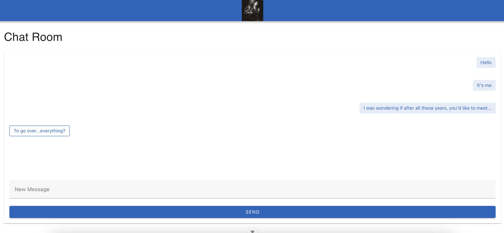

# Adele

A full-stack chat application built with Vue.js and Node.js, featuring WebSocket communication and PostgreSQL message persistence. Like its namesake, it’s here to help you say “hello” in style.



---

## Features

- Real-time messaging with WebSockets
- PostgreSQL for message persistence
- WebSocket echo test client for simulating users
- Vue 3 + Pinia frontend with TypeScript
- Typed SQL queries via pgTyped
- Dockerized PostgreSQL for local development
- Accessible, responsive design

---

## Tech Stack

### Frontend
- Vue 3 with TypeScript
- Vite for build tooling
- WebSocket for real-time communication
- Vue Router for navigation
- Pinia for state management

### Backend
- Node.js with TypeScript
- WebSocket server
- PostgreSQL for data persistence
- SQL query typing with pgTyped

### Infrastructure
- Docker Compose for local PostgreSQL database

## Getting Started

1. Install all dependencies. From this root directory:
```bash
npm run install:all
```
This will run `npm install` in this directory, as well as the frontend and server directories.

2. Make sure Docker Desktop is running — the PostgreSQL container won’t start without it!

3. To start the full development environment:
```bash
npm run dev
````
This will start frontend, backend, and Dockerized PostgreSQL database.

Or, if you'd like to run the echo bot (see `WebSocket Test Client` below), you can run the following instead:
```bash
npm run dev:mock
```

The application will then be available at:
- Frontend: http://localhost:8080
- Backend: http://localhost:3000

## Project Structure

```
├── frontend/               # Vue.js frontend application
│   ├── src/
│   │   ├── assets/         # Static assets and styles
│   │   ├── components/     # Reusable Vue components
│   │   ├── router/         # Vue Router configuration
│   │   ├── stores/         # Pinia state management
│   │   └── views/          # Page components
│
├── server/                 # Node.js backend server
│   ├── config/             # Server configuration
│   ├── db-init/            # Database schema init files (see `Schema `Migrations"` for more details)
│   ├── middleware/         # Express middleware
│   ├── routes/             # API route definitions
│   ├── services/           # Business logic
│   ├── repositories/       # Repositories for interacting with the database
│   │   ├── sql/            # SQL queries
│   │   └── types/          # PgTyped definitions (see `PgTyped Definitions` for more details)
│   ├── tests/              # Jest unit tests
│   └── types/              # TypeScript type definitions
```

## Schema "Migrations"

Add a `.sql` file to `server/db-init/` with your schema changes and restart the server. SQL should be idempotent (use `CREATE TABLE IF NOT EXISTS`) since the scripts run on each server boot.

To reset the DB:
```bash
npm run docker:down
npm run dev
```
---

## PgTyped Definitions
We use [PgTyped](https://pgtyped.dev/) to generate types for SQL input/output. Write your queries in `.sql` files, then run:

```bash
npm run sql:codegen
```

> PgTyped watch mode is on by default for dev.

**Quick tip:**  
Use `:paramName` for input variables, and `:paramName!` to make them required.

---

## WebSocket Test Client
Simulate another user in the chat! You can start the echo bot with:

```bash
npm run dev:websocket-test-client
```

Or include it with the rest of your environment using:

```bash
npm run dev:mock
```

## Available Scripts

### Root Level
- `npm run install:all`: Installs dependencies for all projects.
- `npm run docker:up`: Starts PostgreSQL database.
- `npm run docker:down`: Stops PostgreSQL database
- `npm run db:connect`: Connect to the PostgreSQL database (once it's running with `npm run docker:up`).
- `npm run sql:codegen`: Generates TypeScript types from SQL queries.
- `npm run dev`: Starts the database, frontend, and server.
- `npm run dev:mock`: Starts database, frontend, server, and a WebSocket test client.
- `npm run dev:frontend`: Starts frontend development server.
- `npm run dev:server`: Starts backend server.
- `npm run dev:websocket-test-client`: Starts the WebSocket test client (see `WebSocket Test Client` above).
